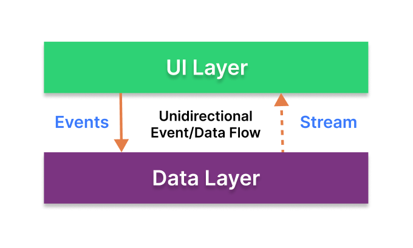
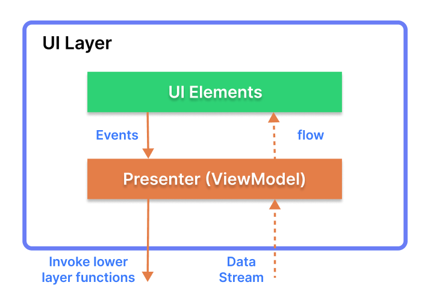

<h1 align="center">Customer List</h1>

  
  🧑‍💼 Customer List is an application that shows a list of contractors along with their classification. Application built with Jetpack (Room, ViewModel), and Material Design based on MVVM architecture.

## Tech stack & Open-source libraries
- Minimum SDK level 26
- [Kotlin](https://kotlinlang.org/) based
- Jetpack
  - Lifecycle: Observe Android lifecycles and handle UI states upon the lifecycle changes.
  - ViewModel: Manages UI-related data holder and lifecycle aware. Allows data to survive configuration changes such as screen rotations.
  - DataBinding: Binds UI components in your layouts to data sources in your app using a declarative format rather than programmatically.
- Architecture
  - MVVM Architecture (View - DataBinding - ViewModel - Model)
  - [Bindables](https://github.com/skydoves/bindables): Android DataBinding kit for notifying data changes to UI layers.
  - Repository Pattern
- [SQLite Database](https://developer.android.com/training/data-storage/sqlite): open-source database provided in Android.

## Architecture
**Customer List App** is based on the MVVM architecture and the Repository pattern, which follows the [Google's official architecture guidance](https://developer.android.com/topic/architecture).

### Architecture Overview

- Each layer follows [unidirectional event/data flow](https://developer.android.com/topic/architecture/ui-layer#udf); the UI layer emits user events to the data layer, and the data layer exposes data as a stream to other layers.
- The data layer is designed to work independently from other layers and must be pure, which means it doesn't have any dependencies on the other layers.

With this loosely coupled architecture, you can increase the reusability of components and scalability of your app.

### UI Layer

The UI layer consists of UI elements to configure screens that could interact with users and [ViewModel](https://developer.android.com/topic/libraries/architecture/viewmodel) that holds app states and restores data when configuration changes.
- UI elements observe the data flow via [DataBinding](https://developer.android.com/topic/libraries/data-binding), which is the most essential part of the MVVM architecture. 
- With [Bindables](https://github.com/skydoves/bindables), which is an Android DataBinding kit for notifying data changes, you can implement two-way binding, and data observation in XML very clean.

### Data Layer

The data Layer consists of repositories, which include business logic, such as querying data from the local database and requesting remote data from the network. It is implemented as an offline-first source of business logic and follows the [single source of truth](https://en.wikipedia.org/wiki/Single_source_of_truth) principle. 
